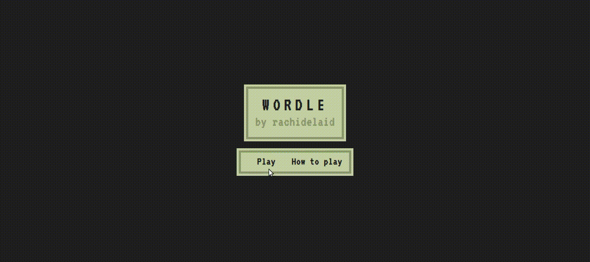

# Wordle

a clone of the wordle game build using vuejs 3, the design is from [here](https://dribbble.com/shots/17440915-WORDLE-gameboy-UI-kit).



## Live Link

you can play the game [here](https://vuejs-wordle.netlify.app/)

## Project setup

```
npm install
```

### Compiles and hot-reloads for development

```
npm run serve
```

### Compiles and minifies for production

```
npm run build
```

### Lints and fixes files

```
npm run lint
```

## Authors

👤 **Rachid El aid**

- GitHub: [@rachidelaid](https://github.com/rachidelaid)
- Twitter: [@rachidelaid1](https://twitter.com/rachidelaid1)
- LinkedIn: [rachid elaid](https://www.linkedin.com/in/rachid-elaid-106336203/)

## 🤝 Contributing

Contributions, issues, and feature requests are welcome!

Feel free to check the [issues page](../../issues/).

## Show your support

Give a ⭐️ if you like this project!
